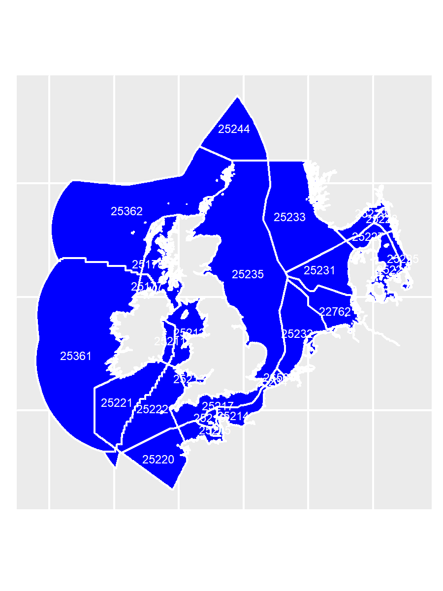

# EMODnet Biology phytoplankton of the Greater North Sea

## Introduction

The project aims to produce comprehensive data product of the occurence and absence of (phyto)plankton species. As a basis, data from EMODnet Biology are used. The selection of relevant datasets is optimized in order to find all planktonic species, and exclude all species that are not planktonic. The occurences from EMODnet Biology were complemenented with absence data assuming fixed species lists within each dataset and year. The products are presented as maps of the distribution of the 100 most common species of (phyto)plankton in the Greater North Sea. 

This product then is also used for interpolated maps, using the DIVA software. 

## Geographical coverage

The aim is to cover the Greater North Sea. Subareas from the eez-iho layer in marineregions.org were selected as in the map below. Kattegat and Skagerrak were excluded for the moment, but could be added in a later stage. 



## Temporal coverage

## Directory structure

```
{{directory_name}}/
├── analysis
├── data/
│   ├── derived_data/
│   └── raw_data/
├── docs/
├── product/
└── scripts/
```

* **analysis** - Markdown or Jupyter notebooks
* **data** - Raw and derived data
* **docs** - Rendered reports
* **product** - Output product files
* **scripts** - Reusable code

## Data

Raw data were downloaded from EMODnet Biology using WFS requests. This was done in two steps. 

1. Per subregion, all observations of species with the trait "phytoplankton" or "Phytoplankton" were extracted. 

2. Because of uncertainties in extracting all phytoplankton species (due to absence of traits for example) all data was extracted for these datasets. Within these datasets phyla were selected that contain phytoplankton species, after which a manual selection was performed to filter out non-phytoplankton species also belonging to these phyla (e.g. macroalgae).

The datasets included were:

| Dataset | EMODnet Biology link |
| ---------------------------- | ------------------------------------------------------------------ |
| Continuous Plankton Recorder (Phytoplankton) | https://www.emodnet-biology.eu/data-catalog?module=dataset&dasid=785 |		
| NODC World Ocean Database 2001: Plankton Data | https://www.emodnet-biology.eu/data-catalog?module=dataset&dasid=1985 |
| REPHY: Network Monitoring phytoplankton | https://www.emodnet-biology.eu/data-catalog?module=dataset&dasid=2451 |
| ICES Phytoplankton Community dataset | https://www.emodnet-biology.eu/data-catalog?module=dataset&dasid=4424 |
| AMOREII: Advanced Modelling and Research on Eutrophication Linking Eutrophication and Biological Resources (AMOREII) | https://www.emodnet-biology.eu/data-catalog?module=dataset&dasid=5977 |
| AMOREIII: Combined Effect of Changing Hydroclimate and Human Activity on Coastal Ecosystem Health (AMOREIII) | https://www.emodnet-biology.eu/data-catalog?module=dataset&dasid=5978 |
| Phytoplankton Monitoring at the Château du Taureau Station in the Western English Channel, from 2009 to 2011 | https://www.emodnet-biology.eu/data-catalog?module=dataset&dasid=5998 |
| Long-term Monitoring of the Phytoplankton at the SOMLIT-Astan Station in the Western English Channel from 2000 to Present | https://www.emodnet-biology.eu/data-catalog?module=dataset&dasid=5971 |
| LifeWatch observatory data: phytoplankton observations by imaging flow cytometry (FlowCam) in the Belgian Part of the North Sea | https://www.emodnet-biology.eu/data-catalog?module=dataset&dasid=4688 |
| Biogeographic data from BODC - British Oceanographic Data Centre | https://www.emodnet-biology.eu/data-catalog?module=dataset&dasid=1172 |
| DASSH: The UK Archive for Marine Species and Habitats Data | https://www.emodnet-biology.eu/data-catalog?module=dataset&dasid=5247 |
| L4 Plankton Monitoring Programme | https://www.emodnet-biology.eu/data-catalog?module=dataset&dasid=1495 |
| Phytoplankton data for Danish marine monitoring (ODAM) from 1988 - 2016 | https://www.emodnet-biology.eu/data-catalog?module=dataset&dasid=5664 |
| Dutch long term monitoring of phytoplankton in the Dutch Continental Economical Zone of the North Sea | https://www.emodnet-biology.eu/data-catalog?module=dataset&dasid=5758 |
| PANGAEA - Data from various sources | https://www.emodnet-biology.eu/data-catalog?module=dataset&dasid=2722 |
| PANGAEA - Data from Ocean margin exchange project (OMEX I) | https://www.emodnet-biology.eu/data-catalog?module=dataset&dasid=2768 |
| Macrobenthos and Phytoplankton monitoring in the Belgian coastal zone in the context of the EU Water Framework Directive (WFD) | https://www.emodnet-biology.eu/data-catalog?module=dataset&dasid=5945 |
| IPMS-PHAEO: Dynamics of coastal eutrophicated ecosystems | https://www.emodnet-biology.eu/data-catalog?module=dataset&dasid=5951 |
| AMORE: Advanced Modelling & Research on Eutrophication & the Structure of Coastal Planktonic Food-webs: Mechanisms & Modelling (AMORE) | https://www.emodnet-biology.eu/data-catalog?module=dataset&dasid=5976 |


```
{{data_wfs_request}}
```

## Analysis

...

## Citation
Please cite this product as: *Willem Stolte, & Luuk van der Heijden (2020). Presence/Absence maps of phytoplankton in the Greater North Sea. Integrated data products created under the European Marine Observation Data Network (EMODnet) Biology project (EASME/EMFF/2017/1.3.1.2/02/SI2.789013), funded by the by the European Union under Regulation (EU) No 508/2014 of the European Parliament and of the Council of 15 May 2014 on the European Maritime and Fisheries Fund*
